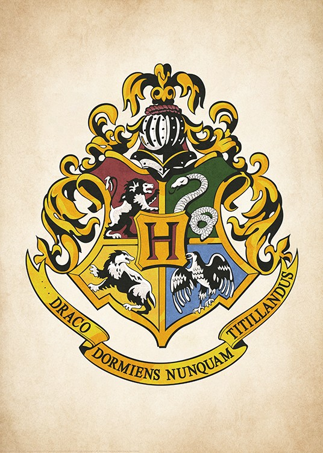

# Hogwarts Acceptance Letter Generator

## Introduction

The Hogwarts Orientation is a Python program that simulates the process of receiving an acceptance letter to Hogwarts School of Witchcraft and Wizardry. This program allows the user to input their name, gender, blood status, and description, and it will determine their Hogwarts house and roommates based on their preferences and information.

## Features

### 1. Accepting Invitation

- **Function**: `accepting_invitation() -> Student`
- **Description**: This function asks the user for their name, gender, blood status, and description to create a new student.

### 2. Sorting Hat Ceremony

- **Function**: `sorting_hat(student: Student) -> str`
- **Description**: The Sorting Hat Ceremony is simulated, allowing the student to choose their preferred Hogwarts house based on their blood status and description.

- **Function**: `preference(student: Student) -> list`
- **Description**: This function calculates the student's house preferences based on their blood status and description.

- **Function**: `change_house(student: Student, house: str) -> None`
- **Description**: It allows the student to change their house if they wish.

### 3. Sorting Roommates

- **Function**: `sort_roommates(student: Student) -> list`
- **Description**: This function sorts roommates based on the student's gender and house.

- **Function**: `roommates_list(students: list) -> None`
- **Description**: It lists the roommates, with a maximum of 4 students per room.

### 4. Writing to Roster

- **Function**: `write_coster(student: Student, file_path: str) -> None`
- **Description**: This function adds the student's information to the roster.csv file, including their name, house, gender, blood status, and description.

## Usage

To use the Hogwarts Acceptance Letter Generator, follow these steps:

1. Run the program by executing the `main()` function in the code.

2. You will be prompted to provide your name, gender, blood status, and description.

3. The Sorting Hat Ceremony will determine your preferred Hogwarts house based on your inputs.

4. You will be assigned roommates who share the same gender and house.

5. Your information will be added to the roster.csv file for future reference.

6. Enjoy your journey at Hogwarts!

## Dependencies

- `re` (for parsing students' answer regarding sorting houses)
- `csv` (for parsing csv - crud operation)
- `random` (for randomly choosing roommates)
- `inflect` (for generating house preferences)
- `model` (for defining the Student class)

## File Structure

- `roster.csv`: Stores student information.
- `hogwarts.jpeg`: Hogwarts logo image.

## Author

- Author: Yang Li
- GitHub: [[Yang Li's GitHub Profile]](https://github.com/YoungAndY2m)
