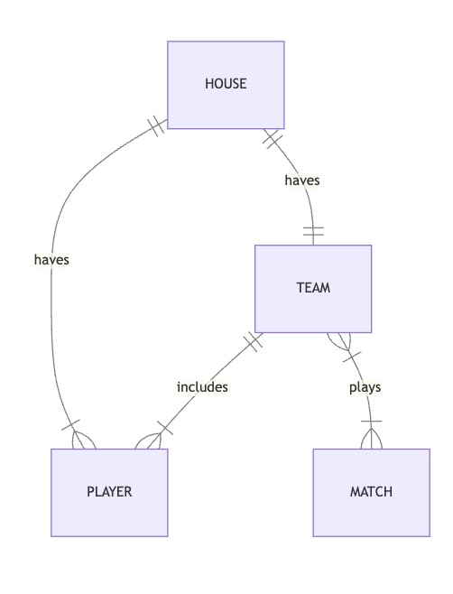

# Hogwarts Quidditch Management System

By Yang Li
- Github: YoungAndY2m
- edX: yang92
- City & Country: Durham, NC, USA
- Date recorded: 2023-12-30

Video overview: [<URL HERE>](https://www.youtube.com/watch?v=Mz5TcSViY5E)

## Scope

The Hogwarts Quidditch Management System is a database system designed to manage various aspects of the Quidditch tournament at Hogwarts School of Witchcraft and Wizardry. As such, included in the database's scope is:

* Players, including basic identifying information
* Teams, including basic identifying information
* Houses, including basic identifying information
* Matches, including the time at which the match was held, the location, and the winner of the match

Out of scope are elements like player performance, years, and other non-core attributes.

## Functional Requirements

This database will support:

* CRUD operations for players, teams, and matches records
* Recording match results and maintaining leaderboards
* Associating players with their respective houses and teams
* Identifying team captains
* Performing common searches, such as finding players by particular position

## Representation

Entities are captured in SQLite tables with the following schema.

### Entities

The database includes the following entities:

#### Players

The `players` table includes:

* `id`, which specifies the unique ID for the player as an `INTEGER`. This column thus has the `PRIMARY KEY` constraint applied.
* `first_name`, which specifies the player's first name as `TEXT`, given `TEXT` is appropriate for name fields.
* `last_name`, which specifies the player's last name. `TEXT` is used for the same reason as `first_name`.
* `year`, which specifies the player's year.
* `position`, which specifies the player's position in Quidditch, and is restricted to values ('chaser', 'seeker', 'beater', 'keeper') due to the CHECK constraint.
* `captain`, which indicates if the player is a team captain (1 for captain, 0 for not captain), and is restricted by the CHECK constraint.
* `broomstick`, which specifies the player's broomstick.
* `start_date`, which specifies the date when the player joined the team, with a default value of the current timestamp (`DEFAULT CURRENT_TIMESTAMP`).
* `house_id`, which is a foreign key referencing the "houses" table to associate the player with a particular house.
* `team_id`, which is a foreign key referencing the "teams" table to associate the player with a particular team.

#### Teams

The `teams` table includes:

* `id`, which specifies the unique ID for the team as an `INTEGER`. This column thus has the `PRIMARY KEY` constraint applied.
* `name`, which specifies the name of the Quidditch team as `TEXT`. This is a required field and cannot be empty.
* `house_cup_wins`, which represents the number of times the team has won the House Cup. It has a default value of 0, indicating no wins initially.
* `house_id`, which is a foreign key referencing the "houses" table. It associates the team with a particular house.
* `captain_id`, which is a foreign key referencing the "players" table. It specifies the team's captain, ensuring that the captain is a valid player in the database.

#### Houses

The `houses` table includes:

* `id`, which specifies the unique ID for a house as an `INTEGER`. This column thus has the `PRIMARY KEY` constraint applied.
* `name`, which specifies the name of a Hogwarts house as `TEXT`. This field is constrained using a `CHECK` constraint to ensure that only valid house names ('Gryffindor', 'Hufflepuff', 'Ravenclaw', 'Slytherin') can be stored in this column.

The `houses` table is used to represent the four Hogwarts houses: Gryffindor, Hufflepuff, Ravenclaw, and Slytherin. Each house is uniquely identified by its name and has a corresponding unique ID. This table plays a crucial role in associating students and teams with their respective houses, facilitating the management of Quidditch teams and other aspects of Hogwarts life.

#### Matches

The `matches` table includes:

* `id`, which specifies the unique ID for a match as an `INTEGER`. This column thus has the `PRIMARY KEY` constraint applied.
* `date`, which specifies the date and time of the match as a `NUMERIC` value. The `NOT NULL` constraint ensures that every match entry must have a valid date and time. The `DEFAULT CURRENT_TIMESTAMP` constraint specifies that if no date is provided, the current timestamp will be used as the default value.
* `location`, which specifies the location where the match took place as `TEXT`. This field is marked as `NOT NULL`, ensuring that every match record contains location information.
* `winner`, which specifies the winning team or house of the match as `TEXT`. The `NOT NULL` constraint guarantees that each match entry has a recorded winner.

#### Leaderboards

The `leaderboards` table includes:

* `id`, which specifies the unique ID for a leaderboard entry as an `INTEGER`. This column thus has the `PRIMARY KEY` constraint applied.
* `team_id`, which is an `INTEGER` representing the ID of the team associated with this leaderboard entry. This column has a `FOREIGN KEY` constraint referencing the `id` column in the "teams" table. The `ON DELETE CASCADE` option means that if the corresponding team is deleted, the leaderboard entry will also be deleted.
* `match_id`, which is an `INTEGER` representing the ID of the match associated with this leaderboard entry. This column has a `FOREIGN KEY` constraint referencing the `id` column in the "matches" table. The `ON DELETE CASCADE` option means that if the corresponding match is deleted, the leaderboard entry will also be deleted.

### Relationships

The below entity relationship diagram describes the relationships among the entities in the database.

As detailed by the diagram:

* One house is capable of having 0 to many players. 0, if they have yet to process any player, and many if they have to more than one players. A player can only be admitted to one and only one house. 
* A house can have 0 to 1 team, as there might be houses that currently do not have any teams, or there may be one team that belong to one house. A team is housed by one and only one house. This relationship indicates that each team is associated with a specific house, and no team exists without being part of a house.
* A team includes 1 to many players, meaning that a team must have at least one player, but there is no upper limit to the number of players it can have. A player is included in one and only one team, which implies that players are exclusive to their teams and do not play for multiple teams.
* A team plays 0 to many matches, where 0 represents teams that haven't played any matches yet, and many indicates participation in multiple matches. A match is played by two teams, which is typical in competitive scenarios where one team plays against another.

## Optimizations

Per the typical queries in `queries.sql`, it is common for users of the database to access all matches played by any particular player. For that reason, indexes are created on the `first_name`, `last_name`, and `position` columns to speed the identification of players by those columns.

Similarly, it is also common practice for a user of the database to concerned with viewing all winning results for matches. As such, an index is created on the `winner` column in the `match` table to speed the identification of problems by winner.

## Limitations

The current schema assumes two-teams matches. 
